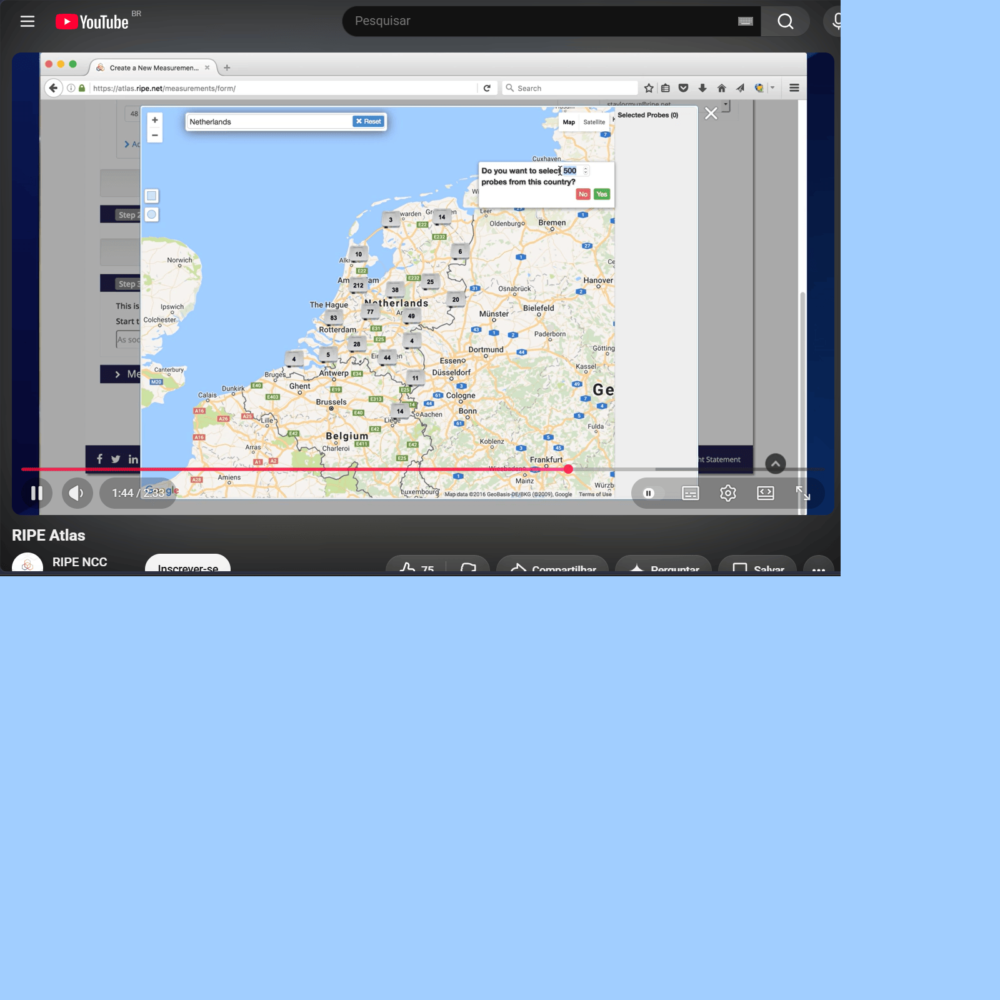
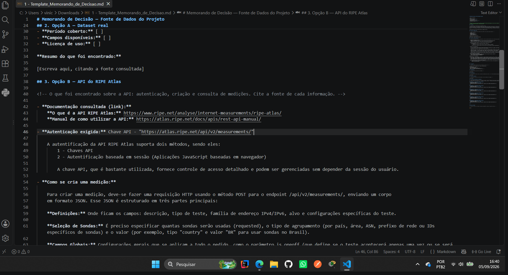
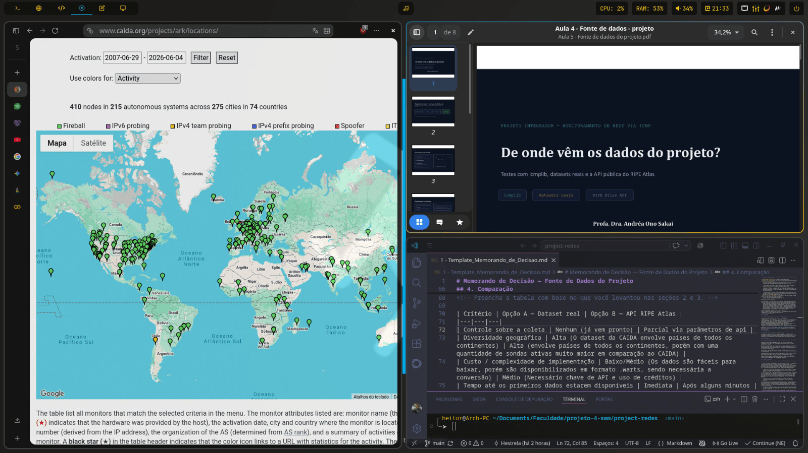
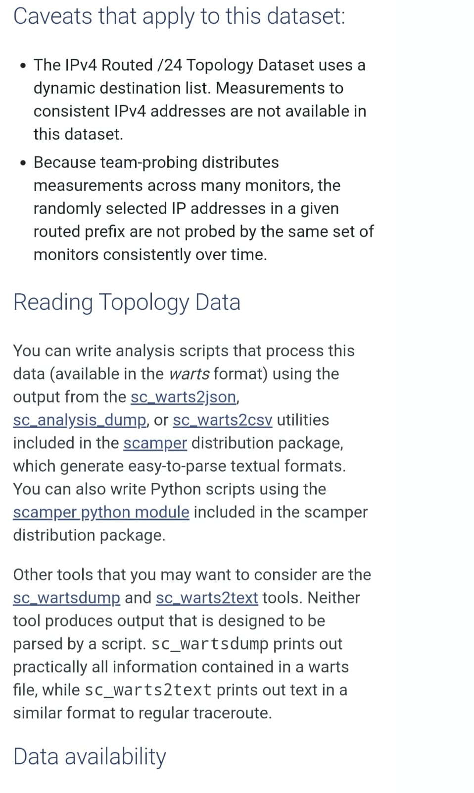
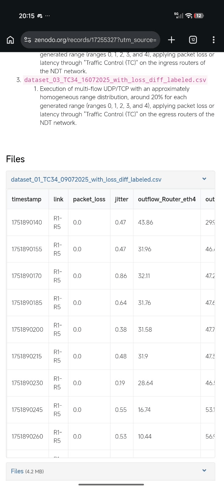

# Memorando de Decisão — Fonte de Dados do Projeto

[Repositório do GitHub](https://github.com/ViniEduOliveira/project-redes/blob/main/Memorando_de_Decisao_grupo4.md)

| Campo | Informação |
|---|---|
| Curso / Disciplina | Ciência da Computação / Estrutura de dados II
| Projeto integrador | Estrutura de Dados II , Redes de Computadores , Análise e Projeto de Sistemas
| Orientador(a) | Andrea Sakai , Denise De Souza , Luis De Oliveira  
| Data de entrega desta etapa | 08/09/2026 
| Integrantes do grupo | Gabriel Romão , Giulia Ayumi , Heitor Estrela , Miguel Souza , Vinicius Oliveira 

---

> Preencha cada seção com o que você encontrou na pesquisa. Não deixe nenhum campo com o texto entre colchetes — substitua pelo seu conteúdo. Toda informação levantada nas Opções A e B precisa indicar a fonte de onde veio.

## 1. Situação

<!-- Em uma frase: qual decisão precisa ser tomada e por quê. 
O pipeline do projeto já está definido: qualquer fonte de dados precisa produzir registros que se transformem em janelas e, por fim, em X = [latência, perda, jitter]. Falta decidir de onde virão esses dados na próxima fase. A equipe do projeto precisa recomendar, com base em pesquisa e não em preferência pessoal, se a próxima etapa deve usar um dataset real já publicado ou a API do RIPE Atlas. O grupo deve produzir um memorando de decisão com a recomendação da tomada de decisão. A recomendação só tem valor se for sustentada por pesquisa real — não existe resposta pronta para copiar; ela precisa ser construída a partir do que vocês encontraram.
-->

O grupo precisa decidir de onde vamos puxar os dados pra alimentar nosso pipeline nas próximas etapas. O 
objetivo é escolher entre pegar uma base de dados que já tá pronta na internet (dataset real) ou usar a API do RIPE Atlas pra fazer nossas próprias medições. Essa escolha é importante porque vai definir como o grupo vai extrair as métricas de latência, perda e jitter pro projeto.

## 2. Opção A — Dataset real

<!-- O que foi encontrado sobre um dataset real de ICMP. Cite a fonte de cada informação. -->

- **Origem / link:** CAIDA (Projeto Ark IPv4 Topology) - https://www.caida.org/catalog/datasets/ipv4_routed_24_topology_dataset/
- **Formato:** Arquivos no formato .warts (precisa converter pra CSV ou TXT)
- **Período coberto:** Tem histórico desde setembro de 2007 até os dias de hoje.
- **Campos disponíveis:** IPs de origem e destino, timestamp, RTT (latência) e respostas dos pacotes ICMP.
- **Licença de uso:** Gratuito pra uso acadêmico e pesquisa (só precisa fazer um cadastro simples).

- **Resumo do que foi encontrado:**

    Pesquisando sobre datasets reais, encontramos o projeto Ark do CAIDA, que é bem conhecido nessa área de redes. Eles disparam pings pro mundo inteiro e guardam isso
 num banco de dados gigante. A parte boa é que já tem muito dado coletado e a gente não precisa configurar nenhuma infraestrutura de teste. O lado ruim é que os arquivos num formato próprio deles (.warts), então a gente vai ter o trabalho extra de arrumar um script pra converter isso pra CSV antes de jogar no nosso pipeline. Além disso, não dá pra escolher os alvos, a gente fica dependente das rotas e IPs que eles mesmos escolheram testar. (Fonte: Documentação do dataset Ark no site do CAIDA).
    

## 3. Opção B — API do RIPE Atlas

<!-- O que foi encontrado sobre a API: autenticação, criação e consulta de medições. Cite a fonte de cada informação. -->

- **Documentação consultada (link):**  
    **Manual de como utilizar a API:** https://atlas.ripe.net/docs/apis/rest-api-manual/
                                     
- **Autenticação exigida:** Chave API - "https://atlas.ripe.net/api/v2/measurements/"

    A autentificação da API RIPE Atlas suporta dois métodos, sendo eles:
        1 - Chaves API
        2 - Autentificação baseada em sessão (Aplicações JavaScript baseadas em navegador)

    A chave API, que é bastante utilizada, fornece controle de acesso detalhado e podem ser gerenciadas sem depender da sessão do usuário.

- **Como se cria uma medição:** 

    Para criar uma medição, deve-se fazer uma requisição HTTP usando o método POST para o endpoint /api/v2/measurements/, enviando um corpo
    em formato JSON. Esse JSON é estruturado em três partes principais:

    **Definições:** Onde ficam os campos: descrição, tipo de teste, família de endereço IPv4/IPv6, alvo e configurações específicas do teste.

    **Seleção de Sondas:** É preciso especificar quantas sondas serão usadas (requested), o tipo de agrupamento (por país, área, ASN, prefixo de rede ou IDs específicos de sondas) e o valor (por exemplo, tipo "country" e valor "BR" para usar sondas no Brasil).

    **Campos Globais:** Configurações gerais que se aplicam a todo o pedido, como o parâmetro is_oneoff (que define se o teste acontecerá apenas uma vez ou se será contínuo), data de início (start_time), data de término (stop_time) e qual conta consumirá os créditos da plataforma (bill_to).

- **Como se consultam os resultados:** 
    Os resultados da API são retornados em JSON. Deve-se fazer uma requisição usando o método GET. 

    **Formato:**  GET /api/v2/measurements/200000/results/

    O número (200000) representa o id da medição

- **Resumo do que foi encontrado:**

    A API RIPE Atlas, é uma rede gigante com milhares de sondas espalhadas pelo mundo para testar a internet. A parte boa é que a gente não fica engessado: usando a API deles, podemos escolher exatamente de qual país a medição vai sair e qual alvo testar. E como os resultados já chegam em JSON, facilita extrair só o que importa para o pipeline (latência, perda e jitter). O lado ruim é que a gente vai ter mais trabalho no código inicial do que se só baixasse um dataset. Vamos precisar montar as requisições HTTP, gerenciar a chave de autenticação e lidar com um sistema de "créditos" para criar as medições. Além disso, como o teste acontece na hora, o nosso script vai ter que ter uma lógica para esperar as sondas terminarem o trabalho antes de tentar puxar os dados.

- Tópico adicionado pelo grupo **Como ver nossos créditos:** 

    Através da visão geral da conta que é o ponto de entrada para API de créditos, onde conseguiremos ver o saldo, renda e os gastos diários

    **Formato:** GET /api/v2/credits/

## 4. Comparação

<!-- Preencha a tabela com base no que você levantou nas seções 2 e 3. -->

| Critério | Opção A — Dataset real | Opção B — API RIPE Atlas |
|---|---|---|
| Controle sobre a coleta | Nenhum (já vem pronto) | Parcial via parâmetros de api |
| Diversidade geográfica | Alta (O dataset da CAIDA envolve países de todos os continentes) | Alta (envolve países de todos os continentes, porém com uma quantidade de sondas ativas muito maior em comparação ao CAIDA) |
| Custo / complexidade de implementação | Baixo/Médio (Os dados são fáceis para baixar, porém são disponibilizados em formato .warts, sendo necessária a conversão) | Médio (Necessário chave de API e uso de créditos) |
| Tempo até os primeiros dados estarem disponíveis | Imediata | Após alguns minutos |

## 5. Recomendação

<!-- Uma frase direta: qual opção você recomenda. -->

Recomendamos a API, pois é mais fácil manipular os dados e gerar dados novos comparados ao dataset real, no qual não temos tanto controle assim perante os dados pesquisados, além de alguns estudos precisarem de um tratamento dos dados e a conversão do arquivo para alcançar os resultados necessários para nosso trabalho.

## 6. Justificativa

<!-- Por que essa opção vence a outra, com base nas evidências das seções 2, 3 e 4 — não em preferência pessoal. -->

Decidimos utilizar a API do RIPE Atlas porque, por mais que apresente uma complexidade inicial maior, ela oferece mais controle para a coleta dos dados necessários do projeto.

Diferente do dataset CAIDA Ark, no qual os dados já foram coletados e dependemos das medições realizadas pelo projeto, porém com o RIPE Atlas podemos definir as características das nossas próprias medições, por exemplo, como sondas utilizadas e os destinos que serão testados.

Além disso, os resultados das medições podem ser consultados por meio da API em formato JSON, o que facilita a extração e organização dos dados que serão utilizados no nosso pipeline.

A possibilidade de realizar novas medições também permite adaptar a coleta caso os dados obtidos inicialmente não sejam suficientes para as próximas etapas.

Considerando principalmente o maior controle sobre a coleta, a flexibilidade das medições e a facilidade de integração dos resultados com o pipeline, decidimos utilizar a API do RIPE Atlas como fonte de dados do projeto.

## 7. Riscos e limitações

<!-- O que pode dar errado com a opção escolhida, e como isso poderia ser mitigado. -->

1. Limite de créditos: Toda medição na RIPE Atlas consome créditos, e a conta só tem créditos limitados (ganhos por hospedar sondas, ser membro RIPE ou receber transferência). O sistema de créditos existe para reconhecer a contribuição de quem participa da rede e é a forma de "pagar" pelas medições sob demanda que você cria. Se o grupo criar medições contínuas (não is_oneoff) ou pedir muitas sondas de uma vez, os créditos podem acabar antes do fim do projeto, interrompendo a coleta.

    - Mitigação: Priorizar medições pontuais (is_oneoff: true) enquanto se testa o pipeline, e só depois migrar para medições contínuas e monitorar o saldo pelo endpoint de créditos (GET /api/v2/credits/).

2. Rate limiting da API: A API impõe limites de requisições por segundo, e endpoints de criação de medição têm limite mais restrito que os de leitura já que a API do RIPE Atlas aplica limitação de taxa para proteger o serviço e garantir uso justo entre todos os usuários. Se o script do pipeline ficar fazendo polling agressivo para saber se os resultados já chegaram, ele pode tomar erro HTTP 429 (Too Many Requests). 

    - Mitigação: Espaçar as requisições de polling (nada de loop apertado consultando o mesmo endpoint), e usar um tamanho de página razoável nas consultas.

3. Atraso e assincronia dos resultados: Diferente de baixar um dataset pronto, os dados da RIPE Atlas só existem depois que as sondas escolhidas executam a medição. O script precisa esperar e verificar quando o resultado fica disponível antes de alimentar o pipeline. Isso adiciona uma dependência de tempo real que o pipeline de janelas precisa tolerar.

    - Mitigação: Implementar lógica de espera/retry com backoff, e desenhar a etapa de "janelas" para lidar com chegada assíncrona dos dados, não só com um arquivo estático já completo.

4. Cobertura geográfica desigual das sondas: A quantidade de sondas varia muito por país/ASN. Se o grupo pedir sondas do Brasil, por exemplo, o número disponível é bem menor que em países com mais sondas ativas, o que pode limitar a diversidade dos dados coletados.

    - Mitigação: Combinar critérios de seleção (país + ASN + área) e documentar essa limitação de amostra na análise final, em vez de tratar os dados como representativos do mundo todo.

5. Dependência de disponibilidade externa e da chave de API: O pipeline passa a depender do RIPE Atlas estar no ar e da chave de autenticação estar válida e segura e vazamento da chave permitiria terceiros gastarem os créditos da conta do grupo.

    - Mitigação: Guardar a chave em variável de ambiente (nunca no código versionado) e monitorar erros de autenticação/indisponibilidade como parte do próprio pipeline.

## 8. Contribuição Individual dos Integrantes

<!-- cada integrante deve descrever, com suas próprias palavras, o que efetivamente fez nesta etapa. Contribuições genéricas como "ajudei em tudo" não serão aceitas. Use verbos de ação e seja específico (ex.: "pesquisei , analisei, testei, ... apresentei prós/contras ao grupo, ...").-->

### Integrante 1 — Giulia Ayumi Shimada Cardoso 
- **O que fez nesta etapa:** 

Nesta etapa do projeto, eu pesquisei, aprendi e anotei tudo sobre a API escolhida, logo após, contribui respondendo a questão 7 do template. Para responder a questão, fiz uma pesquisa mais afundo através de links na internet para saber exatamente quais seriam os riscos e limitações da escolhida. Nesta etapa também, era necessário propor soluções aos problemas encontrados, e acredito que essa tenha sido minha maior dificuldade, uma vez que não sou muito boa para encontrar soluções que realmente "concerte" o que há de errado, porém lendo e relendo vi que consegui. Após as pesquisas e ao vídeo assistido,
finalizei minha parte e mandei no nosso grupo do WhatsApp criado para esse projeto.
- **Tempo dedicado (aprox.):** 1h25min
- **Evidência da contribuição** *(print de conversa, rascunho, e-mail, documento compartilhado etc.)*:

**O arquivo abaixo é um gif, a cada 4 segundos ele muda a evidência**

### Integrante 2 — Vinicius Eduardo Santos De Oliveira
- **O que fez nesta etapa:** 

Nesta etapa do projeto, eu realizei uma pesquisa aprofundada sobre a API RIPE Atlas. Para entender exatamente como a rede de medição funciona, acessei e estudei a documentação no site oficial da API RIPE Atlas, conforme referências bibliograficas, de onde tirei a base para nossa análise. Logo após, contribuí organizando o grupo para a definição das tarefas e as votações necessárias.

Nesta etapa também, assumi a responsabilidade de unir as pesquisas de todos dentro de um único template, realizando toda a formatação do arquivo .md, além de ajudar nas melhorias de texto do documento. Ajustando e relendo os parágrafos, vi que conseguimos um excelente resultado. Após as revisões finais, concluí minha parte atualizando o arquivo no GitHub e criando a tag para o envio oficial à professora.
- **Tempo dedicado (aprox.):** 3h44min
- **Evidência da contribuição** *(print de conversa, rascunho, e-mail, documento compartilhado etc.)*:

**O arquivo abaixo é um gif, a cada 4 segundos ele muda a evidência**

### Integrante 3 — Heitor Estrela De Andrade
- **O que fez nesta etapa:** 

Nesta parte do projeto realizei a comparação entre o dataset real que usamos como base nas pesquisas já feitas pelo grupo e pesquisas que fiz para saber com exatidão a data dos dados da CAIDA e os países de origem dos dados além da origem dos dados da API da RIPE Atlas recomendada pela nossa professora. Também fui responsável por fazer o primeiro rascunho desse memorando, já com as primeiras informações conseguidas no dia 05 de setembro de 2026 e formatação básica para enviar para o GitHub
- **Tempo dedicado (aprox.):** 1h20min
- **Evidência da contribuição** *(print de conversa, rascunho, e-mail, documento compartilhado etc.)*: 

**O arquivo abaixo é um gif, a cada 4 segundos ele muda a evidência**

### Integrante 4 — Gabriel Romão Da Silva 
- **O que fez nesta etapa:** 

Fiquei responsável por levantar as informações da Opção A (dataset real). Comecei pesquisando no Google termos como 'public dataset ICMP latency' e vi o nome do CAIDA aparecendo como referência em alguns trabalhos. Acessei o site deles (caida.org), entrei na área de catálogo de dados e fui vasculhando até achar o projeto Ark. Li a documentação deles pra ter certeza que dava pra extrair os dados de latência e perda que o nosso pipeline precisa. Enquanto lia, percebi que os arquivos vêm num formato diferente (.warts), então já anotei pra avisar o grupo que teríamos o trabalho de converter isso pra CSV depois. Por fim, chequei os termos de uso pra garantir que a licença era gratuita para uso acadêmico e preenchi a seção 2 com esse resumo.
- **Tempo dedicado (aprox.):** 1h30min
- **Evidência da contribuição** *(print de conversa, rascunho, e-mail, documento compartilhado etc.)*: 

**O arquivo abaixo é um gif, a cada 4 segundos ele muda a evidência**

### Integrante 5 — Miguel Augusto da Costa Souza
- **O que fez nesta etapa:** 

Nessa etapa do projeto, eu pesquisei alternativas de datasets que possuíssem os dados necessários para o pipeline, com foco nas informações relacionadas à latência, perda de pacotes e jitter. Após levantar algumas possibilidades e enviar os links ao grupo, participei da votação para definir qual fonte de dados seria utilizada como referência para a Opção B, sendo escolhido pelo grupo a API RIPE Atlas. Contribuí para a produção da comparação presente na parte 4. E produzi a recomendação, apresentada na parte 5, apresentando a justificativa da decisão, explicando os motivos que levaram o grupo a escolher a API do RIPE Atlas.
- **Tempo dedicado (aprox.):** 3h30min 
- **Evidência da contribuição** *(print de conversa, rascunho, e-mail, documento compartilhado etc.)*: 

**O arquivo abaixo é um gif, a cada 4 segundos ele muda a evidência**

---

## Fontes consultadas

<!-- Mínimo de 3 fontes. Liste todas as páginas de documentação, artigos ou repositórios usados. -->

CAIDA - CENTER FOR APPLIED INTERNET DATA ANALYSIS. Archipelago (Ark) Monitor Locations. La Jolla: CAIDA, [s.d.]. Disponível em: https://www.caida.org/projects/ark/locations/. Acesso em: 5 set. 2026.

CAIDA - CENTER FOR APPLIED INTERNET DATA ANALYSIS. The IPv4 Routed /24 Topology Dataset. La Jolla: CAIDA, 2008. Disponível em: https://www.caida.org/catalog/datasets/ipv4_routed_24_topology_dataset/. Acesso em: 5 set. 2026.

RIPE NCC. Credits. Amsterdã: RIPE NCC, [s.d.]. Disponível em: https://atlas.ripe.net/docs/getting-started/credits. Acesso em: 5 set. 2026.

RIPE NCC. Rate Limiting. Amsterdã: RIPE NCC, [s.d.]. Disponível em: https://atlas.ripe.net/docs/apis/rest-api-manual/core-concepts/rate-limiting/. Acesso em: 5 set. 2026.

RIPE NCC. REST API Manual. Amsterdã: RIPE NCC, [s.d.]. Disponível em: https://atlas.ripe.net/docs/apis/rest-api-manual/. Acesso em: 5 set. 2026.

RIPE NCC. RIPE Atlas. Amsterdã: RIPE NCC, [s.d.]. Disponível em: https://www.ripe.net/analyse/internet-measurements/ripe-atlas/. Acesso em: 5 set. 2026.

RIPE NCC. RIPE Atlas Documentation. Amsterdã: RIPE NCC, [s.d.]. Disponível em: https://atlas.ripe.net/docs/. Acesso em: 5 set. 2026.

RIPE NCC. RIPE Atlas. [S.l.: s.n.], 13 jan. 2017. 1 vídeo (2 min 34 s). Publicado pelo canal RIPE NCC. Disponível em: https://www.youtube.com/watch?v=Z3SW2vO8qW0. Acesso em: 5 set. 2026.

SAKAI, Andrea Ono. Aula 5 - Fonte de dados do projeto. Mogi das Cruzes: Cruzeiro do Sul Virtual, 2026. Arquivo PDF. Disponível em: https://bb.cruzeirodosulvirtual.com.br/ultra/courses/_1166934_1/file/_23688163_1?courseId=_1166934_1vo. Acesso em: 5 set. 2026.

[Repositório do GitHub](https://github.com/ViniEduOliveira/project-redes/blob/main/Memorando_de_Decisao_grupo4.md)
